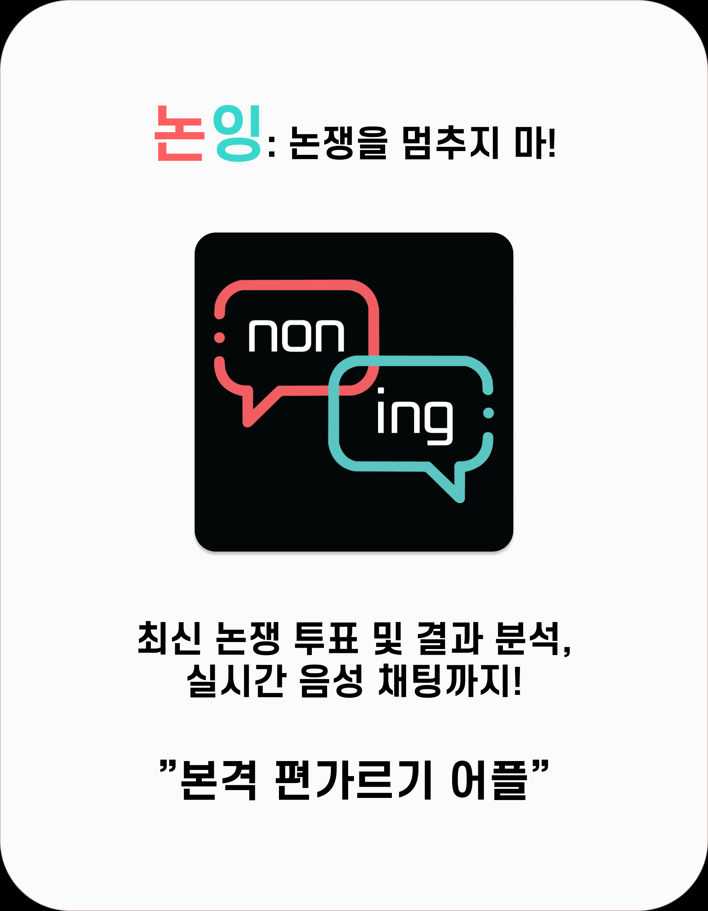

# :rage: NONING(논잉) - 논쟁을 멈추지 마
- 최신 논쟁에 대해 투표하고, 분석 결과를 보며 댓글과 실시간 채팅을 통해 상대방을 설득하는
  **본격 편가르기 어플**



## 💜 프로젝트 진행 기간
2022.07.05~ 2022.08.19(금) 약 45일간 진행<br/>
SSAFY 7기 2학기 공통프로젝트 - NONING

- 논잉 notion : https://rainy-ixia-034.notion.site/adcfe6c242624dcd922986681bafe7ba
<br/>

## 🎵 NONING - 배경

깻잎논쟁, 이성친구 가능 여부 등 미디어에서 다양한 논쟁주제가 나오면서 실시간으로 토론하고 싶다, 혹은 이 주제에 대해 다른 사람은 어떻게 생각할까 궁금하신적 있나요?

NONING은 재밌는 논쟁 주제를 2가지 선택지로 가볍게 투표하고, 반응과 댓글을 보며, 필요시 채팅방에 입장하여 다른 생각을 하고있는 사람들을 설득 할 수 있는 어플입니다!

<br/>

## 💜 주요 기능
---
- ### 논쟁 투표 기능
    - 가벼운 토론 주제를 빠르게 스크롤하고, 선택지를 클릭해 투표가 가능해요!
    - 최신순/인기순, 카테고리 등 원하는 카테고리에 대해서 빠르게 정보를 볼 수 있어요! 
    - 관심이 없으면 다른 투표 주제로, 흥미가 생기면 상세페이지에 갈 수 있습니다.
    - 찜하기 기능이 있어 나중에 어떤 정보가 바뀌었는지 확인이 가능해요!
    <br/>
- ### 상세페이지 기능
    - 상세페이지에선 논쟁 주제에 관한 댓글을 볼 수 있습니다.
    - 배신하기 탭이 있어서, 댓글을 보거나 생각이 바뀌면 선택을 바꿀 수 있어요!
    - 또한 회원가입시 입력했던 정보를 토대로 나이대, 성별, MBTI별 어떤 선택을 했는지 정보를 얻을 수 있습니다.
    - 상대방이 너무 답답하다! LIVE 버튼이 활성화 돼있을 시,실시간 채팅방에 입장해 싸울 수 있습니다.
    <br/>
- ### 라이브 채팅방 기능
    - 상대방이 너무 답답해 설득하고 싶을 때, 라이브 채팅방에서 의견을 나눌 수 있어요!
    - 한 사람의 말에 설득 당해 의견을 바꾸고 싶을 땐, 배신하기 버튼을 눌러서 의견을 바꿉니다.
      - live 채팅방에 있는 유저들에게 ***님이 배신하였습니다 라는 메세지가 나옵니다.
      - 다른 선택을 한 사람들을 설득시켜 채팅방에 배신하기가 많이 올라오는 즐거움을 느껴봐요! 
    <br/>
- ### FLOW 기능
    - 카테고리, 최신/인기, 등 모든게 번거롭다 하시는 분 들을 위한 FLOW!
    - 한 화면에 참여하지 않는 논쟁 주제를 보여줍니다!
    - 휘릭 휘릭 스크롤하며 가볍게 논쟁 주제들을 탐구해봐요!!
    <br/>
- ### 팔로우 / 유저페이지
    - 재밌는 주제를 잘 만들거나 채팅방에서 재밌게 글을 쓴 사람들을 팔로우해 이후에도 특정 논쟁에 대해 어떻게 반응했는지 알 수 있어요!
    - 사용자가 참여한 논쟁 주제, 찜한 주제, 만든 주제를 볼 수 있습니다! 팔로우/팔로잉 버튼도요!
</br>

## ✔ 주요 기술 

---

**Backend - Spring**
- IntelliJ IDEA : 2021.3.1
- IntelliJ Runtime: 11.0.13+7-b1751.21 amd64
- VM : OpenJDK 64-Bit Server VM by JetBrains s.r.o
- JDK : 11.0.15
- Node.js : 14.20.0
- DB : 10.3.34-MariaDB

**Frontend**
- Visual Studio Code IDE
- React Native

**CI/CD**
- Server : AWS EC2 Ubuntu 20.04 LTS
- Docker : 20.10.12
- nginx : 1.18.0
- Jenkins : 2.346.2

<br/>

## ✔ 협업 툴
---
- Git
- Notion
- JIRA
- MatterMost
- Webex

<br/>

## ✔ 협업 환경
---
- Gitlab
  - Git-Flow. develop, FE_develop, BE_develop, CHAT_develop 브랜치를 나누고
  - 각 feature별 브랜치를 따서 작업 진행
  - MR시 Front/Back Maintainer가 확인 후 합병
- JIRA
  - 매주 목표량을 설정하여 Sprint 진행
  - 업무의 할당량을 정하여 Story Point를 설정하고, In-Progress -> Done 순으로 작업  
- 회의
  - MatterMost에서 데일리 스크럼 진행
  - 문제점이 생겼을 때 팀원들에게 직접 소통
- Notion
  - 회의가 있을때마다 회의록을 기록하여 보관
  - 컨벤션 정리
  - api 문서  관리

<br/>

## ✔ 팀원 역할 분배
- 이승연(Backend / 팀장)

- 이도엽(Frontend / FE maintainer)

- 이보나(Frontend / UCC maintainer)

- 김민균(Frontend / Jira maintainer)

- 이재순(Backend / BE maintainer/ CICD)


<br/>

## ✔ 프로젝트 산출물
---
- [기능명세서](doc/기능명세서.xlsx)
- [프로젝트계획서](doc/프로젝트계획서.pdf)
- [화면설계서](doc/화면설계서.md)
- [스토리보드](doc/스토리보드.md)
- [컨벤션](doc/컨벤션.md)
- [Git](doc/git.md)


<br/>

## 서비스 설명 

#### 폴더 구조 - Frontend
```

```

<br/>

#### 폴더 구조 - Backend
```

```

<br/>


## 페이지 기능 소개 
<br/>


