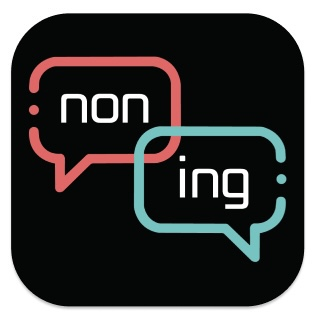
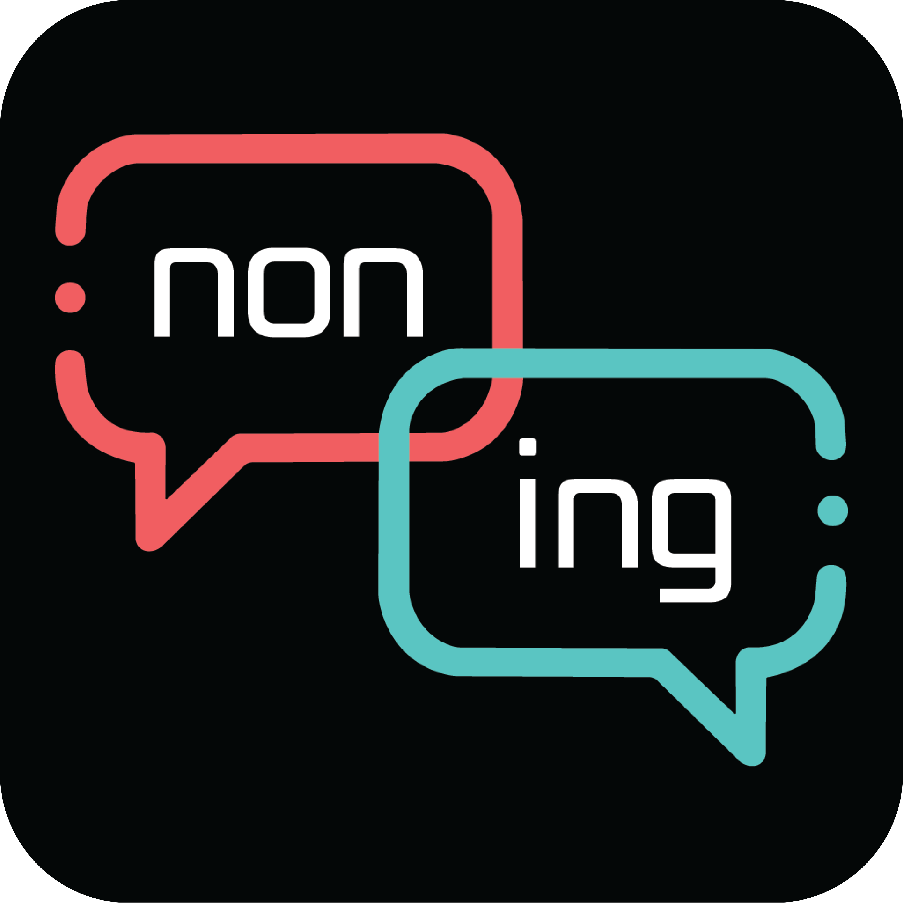

# :fire: NONING(논잉) - 논쟁을 멈추지 마
- 최신 논쟁에 대해 투표하고, 분석 결과를 보며 댓글과 실시간 채팅을 통해 상대방을 설득하는
  **본격 편가르기 어플**
- 📜 [노션](https://rainy-ixia-034.notion.site/adcfe6c242624dcd922986681bafe7ba)
<br/>


<!--  -->


## NONING - 배경 
---
깻잎 논쟁, 이성 친구 가능 여부 등 미디어에서 다양한 논쟁주제가 나오면서 실시간으로 토론하고 싶다, 혹은 이 주제에 대해 다른 사람은 어떻게 생각할까 궁금하신 적 있나요?

NONING은 재밌는 논쟁주제를 2가지 선택지로 가볍게 투표하고, 반응과 댓글을 보며, 필요시 채팅방에 입장하여 다른 생각을 하는 사람들을 설득할 수 있는 앱입니다!

<br/>

## 프로젝트 진행 기간
---
2022.07.11~ 2022.08.19(금) 약 39일간 진행<br/>
SSAFY 7기 2학기 공통프로젝트 - NONING
<br/>

## :heart: 주요 기능 <a name="background"></a>
---
- ### 논쟁 투표 기능
    - 가벼운 토론 주제를 빠르게 스크롤하고, 선택지를 클릭해 투표할 수 있습니다.
    - 최신순/인기순, 카테고리 등 원하는 카테고리에 대해서 빠르게 정보를 볼 수 있어요! 
    - 관심이 없으면 다른 투표 주제로, 흥미가 생기면 상세페이지에 갈 수 있습니다.
    - 찜하기 기능이 있어 나중에 어떤 정보가 바뀌었는지 확인할 수 있어요!
    <br/>
- ### 상세페이지 기능
    - 상세페이지에선 논쟁 주제에 관한 댓글을 볼 수 있습니다.
    - 회원가입 시 입력했던 정보를 토대로 나이대, 성별, MBTI 별 어떤 선택을 했는지 정보를 얻을 수 있습니다.
    - 댓글을 보고 생각이 바뀌면 배신하기 탭을 통해 선택을 바꿀 수 있어요!
    - 상대방이 너무 답답하다! LIVE 버튼이 활성화돼있을 시, 실시간 채팅방에 입장해 싸울 수 있습니다.
    <br/>
- ### 라이브 채팅방 기능
    - 상대방이 너무 답답해 설득하고 싶을 때, 라이브 채팅방에서 의견을 나눌 수 있어요!
    - 한 사람의 말에 설득당해 의견을 바꾸고 싶을 땐, 배신하기 버튼을 눌러서 의견을 바꿉니다.
      - live 채팅방에 있는 유저들에게 ***님이 배신하였다는 메시지가 나옵니다.
      - 다른 선택을 한 사람들을 설득해 채팅방에 배신하기가 많이 올라오는 즐거움을 느껴봐요! 
    <br/>
- ### FLOW 기능
    - 카테고리, 최신/인기, 등 모든 게 번거롭다고 하시는 분 들을 위한 FLOW!
    - 한 화면에 참여하지 않는 논쟁 주제를 보여줘 투표할 수 있습니다.
    - 스크롤 하며 가볍게 논쟁 주제들을 보며 참여해봐요!!
    <br/>
- ### 팔로우 / 유저페이지
    - 재밌는 주제를 잘 만드는 사람, 채팅방에서 재밌게 글을 쓴 사람을 팔로우해 어떤 논쟁을 만들고 참여했는지 알 수 있어요!
    - 팔로우 버튼을 통해 유저페이지 팔로워/팔로잉 탭에서 확인할 수 있고, 원하신다면 언팔로우/팔로잉 취소할 수 있습니다.
    - 사용자가 참여한 찜한, 참여한, 만든 주제를 각각 내/얘찜논, 내/얘참논, 내/얘만논 탭을 통해 확인할 수 있습니다.</br>

## :heavy_check_mark: 주요 기술 

---

**Backend - Spring**
- IntelliJ IDEA : 2021.3.1
- IntelliJ Runtime: 11.0.13+7-b1751.21 amd64
- VM : OpenJDK 64-Bit Server VM by JetBrains s.r.o
- JDK : 11.0.15
- Node.js : 14.20.0
- DB : 10.3.34-MariaDB

**Frontend**
- Visual Studio Code IDE 1.69.0
- react-native : ^0.69.2
- socket.io : ^4.5.1

**Chat**
- express : ^4.18.1
- fs: ^0.0.1-security
- https: ^1.0.0
- mediasoup : ^3.10.5
- path: ^0.12.7
- socket.io ^4.5.1
- ws: ^8.8.1

**CI/CD**
- Server : AWS EC2 Ubuntu 20.04 LTS
- Docker : 20.10.12
- nginx : 1.18.0
- Jenkins : 2.346.2

<br/>

## :heavy_check_mark: 협업 툴 / 환경
---
- GitLab
  - Git-Flow. develop, FE_develop, BE_develop, CHAT_develop 브랜치를 나누고
  - 각 feature별 브랜치를 따서 작업 진행
  - MR시 Front/Back Maintainer가 확인 후 합병
- Notion
  - 회의가 있을때마다 회의록을 기록하여 보관
  - 컨벤션 정리
  - api 문서 관리 등
- JIRA
  - 매주 월요일 목표량을 설정하여 Sprint 진행
  - 업무별 Story Point(1~4)를 설정, In-Progress -> Done 순으로 작업  
- MatterMost
  - Gitlab, JIRA 봇 연동하여 실시간으로 협업
  - Server 연동하여 실시간 에러 처리
- Webex
  - 회의 : 평일 아침 Webex에서 데일리 스크럼 진행
  - 문제점이 생겼을 때 팀원들에게 직접 소통


<br/>

## :heavy_check_mark: 팀원 역할 분배
---
- 이승연(Backend / 팀장)

- 이도엽(Frontend / FE maintainer)

- 이보나(Frontend / UCC maintainer)

- 김민균(Frontend / Jira maintainer)

- 이재순(Backend / BE maintainer / CI/CD)


<br/>

## :heavy_check_mark: 프로젝트 산출물
---
- [기능명세서](doc/기능명세서.xlsx)
- [스토리보드](https://www.figma.com/file/ddfG9w0OgJWo3ld5uFJQPF/WireFrame-2%EC%A1%B0?node-id=58%3A702)
- [와이어프레임](https://www.figma.com/file/ddfG9w0OgJWo3ld5uFJQPF/WireFrame-2%EC%A1%B0?node-id=41%3A2)
- [프로젝트계획서](doc/프로젝트계획서.pdf)
- [컨벤션](doc/컨벤션.md)
- [API명세서](doc/API명세서.xlsx)
- [ERD](doc/ERD.jpg)
- [Git](doc/git.md)
- [테스트케이스](doc/noning_테스트케이스.xlsx)

## :heavy_check_mark: 프로젝트 결과물
---
- [중간발표자료](doc/중간발표자료.pptx)
- [최종발표자료](doc/최종발표자료.pptx)
<br/>

## :heavy_check_mark: 폴더 구조 - Frontend
```
src
├─assets
├─components
│  ├─animations
│  ├─board
│  ├─boardDetail
│  ├─common
│  ├─flow
│  ├─follow
│  ├─home
│  ├─live
│  │  ├─chat
│  │  └─chatInfo
│  ├─loginScreen
│  ├─search
│  ├─setting
│  ├─signUp
│  └─userpage
├─data
├─navigations
├─screens
│  ├─board
│  ├─bottomTab
│  ├─live
│  ├─login
│  ├─search
│  ├─signUp
│  └─userEdit
└─util
```

<br/>

## :heavy_check_mark: 폴더 구조 - Backend
```
src
├─main
│  ├─java
│  │  └─com
│  │      └─fivenonjangi
│  │          └─noning
│  │              ├─config
│  │              │  └─security
│  │              ├─controller
│  │              ├─data
│  │              │  ├─dto
│  │              │  │  ├─board
│  │              │  │  ├─chat
│  │              │  │  ├─comment
│  │              │  │  ├─live
│  │              │  │  └─user
│  │              │  ├─entity
│  │              │  │  ├─board
│  │              │  │  ├─chat
│  │              │  │  ├─comment
│  │              │  │  ├─etc
│  │              │  │  └─user
│  │              │  └─repository
│  │              │      ├─board
│  │              │      ├─chat
│  │              │      ├─comment
│  │              │      ├─etc
│  │              │      ├─live
│  │              │      └─user
│  │              ├─service
│  │              │  ├─board
│  │              │  ├─chat
│  │              │  ├─comment
│  │              │  ├─etc
│  │              │  ├─live
│  │              │  └─user
│  │              ├─Utils
│  │              └─webhook
│  └─resources
└─test
     └─java
            └─com
                └─fivenonjangi
                    └─noning
```

<br/>


## :heavy_check_mark: 페이지 기능 소개 

- 홈


- 논쟁 등록


- 상세페이지


- 플로우


- 실시간 채팅


- 라이브


- 검색


- 사용자 페이지 / 팔로우 / 팔로잉


- 설정(프로필 편집)


- 설정(비밀번호 변경)


- 설정(약관)


- 설정(로그아웃)


- 설정(회원탈퇴)
